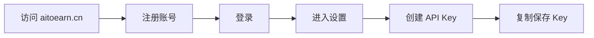
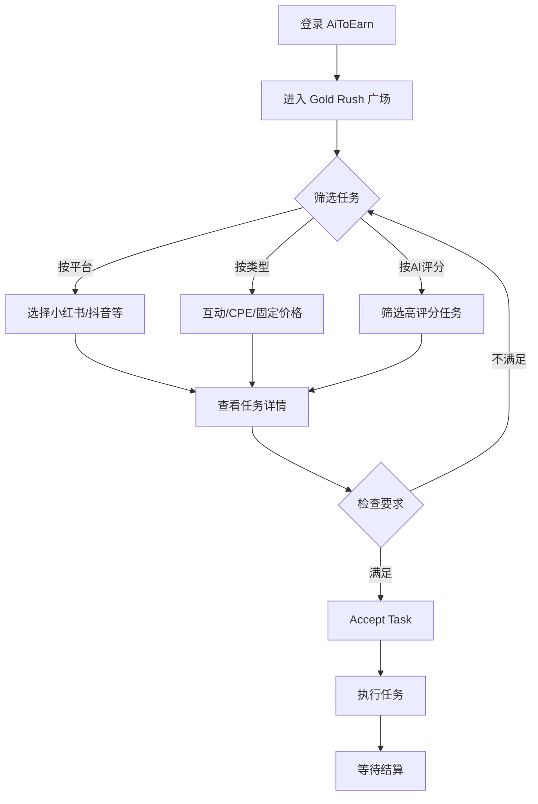
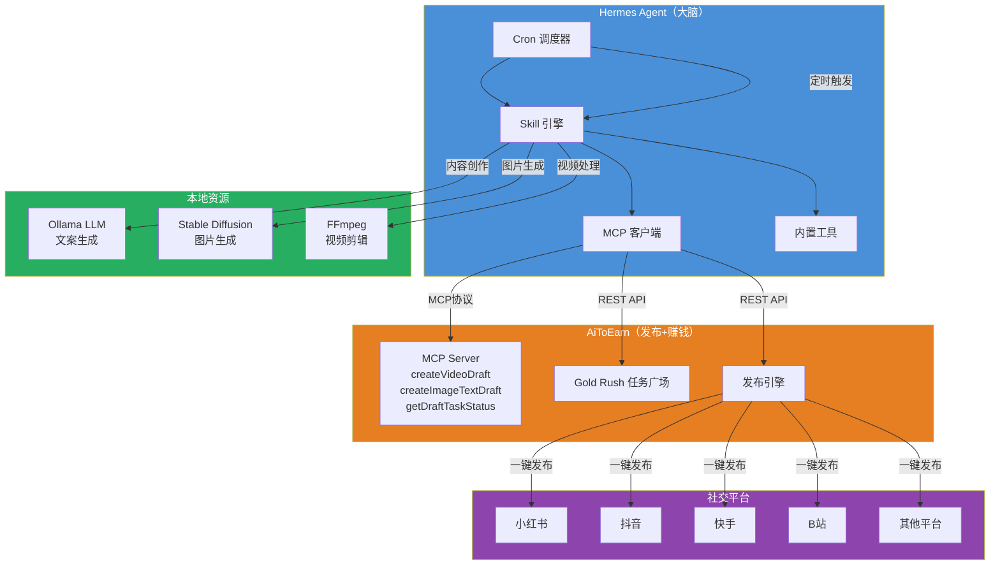

# AiToEarn 配置与自动化操作指引

> 从零起步，基于官方文档和源码调研的全流程实操指南  
> 最后更新：2026-05-22  
> 信息来源：AiToEarn GitHub、官方文档 docs.aitoearn.ai、Hermes Agent 官方文档、npm 包源码

---

## 目录

1. [准备工作](#一准备工作)
2. [注册 AiToEarn 并连接账号](#二注册-aitoearn-并连接社交账号)
3. [AiToEarn 核心操作指南](#三aitoearn-核心操作指南)
4. [自带 AI 替代 Credits](#四自带-ai-替代-credits-可选)
5. [Hermes Agent 全自动工作流编排](#五hermes-agent-全自动工作流编排)
6. [收益预期与风险提示](#六收益预期与风险提示)
7. [常见问题](#七常见问题)

---

## 一、准备工作

### 1.1 身份材料清单

| 项目 | 用途 | 说明 |
|------|------|------|
| **手机号**（主号） | 注册 AiToEarn + 社交平台 | 建议准备 1 个主号，做矩阵可备副号 |
| **身份证** | 平台实名认证（抖音/B站提现需用） | 需与银行卡一致 |
| **银行卡** | 提现到账 | 支持主流国内银行卡 |
| **电脑** | 运行 AiToEarn 网页端 / 后续自动化 | 普通配置即可，无特殊要求 |
| **网络** | 国内网络直连 aitoearn.cn | 不需要代理 |

### 1.2 注册社交平台（按优先级排序）

国内平台注册均需手机号验证。**建议注册顺序：**

| 优先级 | 平台 | 注册方式 | 建议原因 |
|--------|------|----------|----------|
| ⭐⭐⭐ | **小红书** | 手机号注册 | AiToEarn 上任务最多，粉丝门槛低（100粉即可接部分任务） |
| ⭐⭐⭐ | **抖音** | 手机号注册 | 任务量第二，CPE/CPM 任务多 |
| ⭐⭐ | **快手** | 手机号注册 | 有专享任务，粉丝门槛较低 |
| ⭐⭐ | **B 站** | 手机号 + 实名认证 | 有 CPM 任务，但数量较少 |
| ⭐ | **视频号** | 需开通微信 | 任务量较少，作为补充 |

**关键门槛说明：** 从 AiToEarn 实际任务列表看：
- 部分任务要求 **0 粉**（无门槛，可直接接）
- 部分要求 **50/100/800/1 万** 粉丝
- **养号到 100-500 粉**即可覆盖大部分任务

### 1.3 养号建议（第 1-4 周）

| 目标 | 方法 | 每日耗时 |
|------|------|----------|
| 0→100 粉 | 发布真实内容（不限领域），互粉 | 30 分钟 |
| 100→500 粉 | 持续发布，参与平台活动，评论互动 | 30-60 分钟 |
| 500+ 粉 | 可接联盟营销类任务，内容质量为主 | 60 分钟 |

---

## 二、注册 AiToEarn 并连接社交账号

### 2.1 注册 AiToEarn

**来源：** [docs.aitoearn.ai](https://docs.aitoearn.ai/en/help-center/getting-started/4-what-is-aitoearn.md)



**操作步骤：**

1. 打开 **[aitoearn.cn](https://aitoearn.cn)**（中国版）
2. 点击注册，使用邮箱或手机号完成注册
3. 登录后点击左侧菜单 **设置**
4. 找到 **API Key** 选项卡，点击创建
5. 复制生成的 Key 并妥善保存

> ⚠️ **注意事项：**
> - 中国版（aitoearn.cn）与国际版（aitoearn.ai）的 API Key **不通用**
> - 环境和 Key 不匹配会返回 **401 错误**
> - API Key 仅创建时可见一次，丢失需重新创建

### 2.2 Credits 充值（可选）

> 100 Credits = 1 USD

Credits 用于 AiToEarn 内置 AI 服务（视频生成、图片生成等）。**如果自带 AI 生成内容，此步骤可跳过。**

| 服务 | 消耗参考 |
|------|----------|
| LLM 调用（sonnet-4.5） | $3/百万 tokens（输入），$15/百万 tokens（输出） |
| 视频生成（Veo-3.1） | $0.15-0.4/秒 |
| 图片生成（Nano Banana Pro） | $0.05-0.24/张 |
| 视频编辑/翻译 | $0.015-2.0/分钟 |

**来源：** [docs.aitoearn.ai Agent Tool Pricing](https://docs.aitoearn.ai/en/help-center/pricing/agent-price.md)

### 2.3 连接社交账号（添加 Channel）

**来源：** [AiToEarn 发布功能官方文档](https://docs.aitoearn.ai/en/help-center/getting-started/3-getting-started-with-aitoearn-publishing-features.md)

**前置条件：** 先在浏览器中登录目标社交平台

**操作步骤：**

1. 在 AiToEarn 中点击 **Add Channels**
2. 选择要连接的平台（小红书/抖音/快手等）
3. 点击 **Start connection**
4. 在弹出的窗口中授权 AiToEarn 访问你的社交账号
5. 点击 **Add to Aitoearn**
6. 页面右上角出现确认消息即连接成功

**关于 Spaces：**
- 每个授权的 Channel 属于一个 **Space**（可理解为"环境"）
- 每个 Space 可配置**设备指纹**（最重要的是 IP 地址）
- 可以创建任意多个 Spaces

**关于 Relay（自部署场景）：**
> 如果你使用 Docker 自部署 AiToEarn，配置 Relay 后可直接借用官方 aitoearn.ai 的 OAuth 凭据，**不需要自己去各平台申请开发者账号**。

```yaml
# docker-compose.yml 中的配置
RELAY_SERVER_URL: https://aitoearn.ai/api
RELAY_API_KEY: 你的API-Key
RELAY_CALLBACK_URL: http://127.0.0.1:8080/api/plat/relay-callback
```

**来源：** [AiToEarn GitHub README](https://github.com/yikart/AiToEarn)

### 2.4 验证连接

连接成功后，你应该能在 AiToEarn 中看到：
- 已连接平台的账号信息
- 可以创建新的发布任务并选择该平台
- 部分平台可查看数据统计

---

## 三、AiToEarn 核心操作指南

### 3.1 接任务赚钱（Gold Rush 广场）

**来源：** aitoearn.cn 实际页面分析



**任务类型说明：**

| 类型 | 结算方式 | 示例收益 | 适合阶段 |
|------|----------|----------|----------|
| **互动任务**（Interaction） | 按次结算（点赞/收藏/关注） | ¥0.10-0.30/次 | 0 粉起步 |
| **固定价格**（Fixed Price） | 按条结算 | ¥2-3/条 | 有内容能力后 |
| **CPE** | 千次互动结算 | ¥20-110/千次互动 | 需有一定粉丝基础 |
| **CPM** | 千次播放结算 | ¥3-5/千次播放 | 需内容曝光 |

**操作流程：**
1. 进入 **Gold Rush 广场**（首页任务列表）
2. 使用筛选器按平台/标签/日期范围筛选
3. 点击任务卡片查看详情（要求、收益、限额）
4. 确认满足粉丝要求后点击 **Accept Task**
5. AI 生成或手动制作内容
6. 发布到指定平台
7. 等待平台确认互动数据后结算

### 3.2 AI 内容创作

**来源：** [AiToEarn draft-generation MCP 控制器源码](https://github.com/yikart/AiToEarn/blob/main/project/aitoearn-backend/apps/aitoearn-server/src/core/unified-mcp/draft-generation.mcp.controller.ts)

AiToEarn 提供两种 AI 创作方式：

#### 方式一：网页端操作
1. 进入 **Draft Box**
2. 选择 **视频** 或 **图文**
3. 填写提示词（prompt）
4. 选择模型（Veo/Seedance/Grok 等）
5. 点击生成

#### 方式二：通过 API/MCP 调用

支持批量生成、多模型选择、参考图片/视频传入：

```
createVideoDraft:
  - draftType: "video"  # 或 "image_text"
  - prompt: "视频内容描述"
  - model: "veo-3.1"
  - count: 3

createImageTextDraft:
  - draftType: "image"
  - prompt: "图片内容描述"
  - model: "nano-banana-pro"

getDraftTaskStatus:
  - taskId: "任务ID"    # 异步查询进度
```

### 3.3 发布内容（一键分发）

**来源：** [AiToEarn 官方发布指南](https://docs.aitoearn.ai/en/help-center/getting-started/3-getting-started-with-aitoearn-publishing-features.md)

**操作步骤：**
1. 点击 **+ New Work**（右上角）或日历上的 +
2. 选择要发布到的平台（可多选）
3. 编写文案、上传图片/视频
4. 可选择 **Customize for each network** 为不同平台定制内容
5. 选择立即发布或 **设置定时发布**
6. 点击 **Publish**

**支持发布的内容类型：**
- 图文（小红书/微博等）
- 短视频（抖音/快手/视频号/B站/TikTok/YouTube Shorts）
- 长视频（B站/YouTube）
- 帖子（Facebook/Instagram/Threads/X/Pinterest/LinkedIn）

### 3.4 互动运营（浏览器插件）

**来源：** AiToEarn GitHub README

AiToEarn 浏览器插件可实现：
- **自动化操作：** 自动点赞、收藏、关注
- **AI 智能回复：** 调用大模型自动生成评论回复
- **评论挖掘：** 识别"求链接""怎么购买"等高转化信号
- **品牌监测：** 实时追踪品牌讨论

> 插件需在 Chrome/Edge 等浏览器中安装，登录 AiToEarn 账号后使用。

---

## 四、自带 AI 替代 Credits（可选）

**不需要 Credits 的模式：**
- 使用本地 LLM 生成文案（Ollama / llama.cpp）
- 使用 Stable Diffusion / Flux 生成图片
- 使用 FFmpeg 脚本剪辑视频
- 在 AiToEarn 中上传**已准备好的素材**进行发布

**Credits 省不掉的地方：**
- 视频生成（Veo/Seedance 等云端模型，本地跑不动）
- AiToEarn 内置的 MCP `createVideoDraft` / `createImageTextDraft` 工具

**推荐策略：**

| 内容类型 | 推荐方案 | 成本 |
|----------|----------|------|
| 文案/脚本 | 本地 LLM（ollama + 开源模型） | 0 元 |
| 图片 | Flux / Stable Diffusion 本地跑 | 0 元 |
| 视频 | 方案A：AiToEarn Credits | $0.15-0.4/秒 |
| 视频 | 方案B：FFmpeg 模板 + 图片转视频 | 0 元 |
| 发布 | AiToEarn（无额外费用） | 0 元 |
| 接任务 | AiToEarn Gold Rush | 0 元 |

---

## 五、Hermes Agent 全自动工作流编排

### 5.1 概述

Hermes Agent（NousResearch 出品，161k ⭐ 开源项目）原生支持 **MCP 客户端模式**，可直接连接 AiToEarn 的 MCP 服务，实现全自动化内容创作和任务执行。

**原理：**
- Hermes 启动时读取 `~/.hermes/config.yaml` 中 `mcp_servers` 配置
- 自动连接 AiToEarn MCP 端点，发现并注册工具
- 工具在对话中与内置工具（terminal、read_file 等）平级可用

**来源：** [Hermes Agent MCP 官方文档](https://hermes-agent.nousresearch.com/docs/user-guide/features/mcp)、[MCP 配置参考](https://hermes-agent.nousresearch.com/docs/reference/mcp-config-reference)

### 5.2 方式一：MCP 原生集成（推荐）

**第 1 步：安装 Hermes Agent**

```bash
# Linux / macOS / WSL2
curl -fsSL https://raw.githubusercontent.com/NousResearch/hermes-agent/main/scripts/install.sh | bash

# 安装完成后
source ~/.bashrc  # 或 source ~/.zshrc
hermes setup      # 运行配置向导（选择模型提供商等）
```

**第 2 步：配置 AiToEarn MCP 服务器**

编辑 `~/.hermes/config.yaml`，添加：

```yaml
mcp_servers:
  aitoearn:
    url: "https://aitoearn.cn/api/unified/mcp"
    headers:
      x-api-key: "你的API-Key"
    # 可选：限制暴露的工具（只暴露需要用的）
    tools:
      include:
        - createVideoDraft
        - createImageTextDraft
        - getDraftTaskStatus
        - getDraftGenerationPricing
      resources: false
      prompts: false
    timeout: 120
    enabled: true
```

**第 3 步：重启 Hermes 并验证**

```bash
hermes gateway restart
# 或直接在 CLI 中启动
hermes
```

**第 4 步：验证 MCP 工具已加载**

在 Hermes 对话中输入：

```
/aitoearn_tools    # 查看 AiToEarn 的 MCP 工具列表
# 或者直接问：
你现在有哪些工具可用？
```

**来源：** [Hermes MCP Config Reference](https://hermes-agent.nousresearch.com/docs/reference/mcp-config-reference)、[Hermes MCP Integration Guide](https://hermes-agent.nousresearch.com/docs/user-guide/features/mcp)

### 5.3 方式二：OpenClaw 插件（从 OpenClaw 迁移的场景）

> 如果你来自 OpenClaw，插件安装方式如下：

```bash
# 安装 AiToEarn OpenClaw 插件（来源：npm @aitoearn/openclaw-plugin-cli）
npx -y @aitoearn/openclaw-plugin-cli

# 按照提示选择环境并输入 API Key
# 之后迁移到 Hermes（如果已安装 Hermes）
hermes claw migrate     # 自动导入 OpenClaw 的设置和插件
```

**来源：** [AiToEarn GitHub README](https://github.com/yikart/AiToEarn)、[Hermes 迁移文档](https://hermes-agent.nousresearch.com/docs/user-guide/features/mcp)

### 5.4 方式三：Hermes Cron 定时任务

Hermes 内置 cron 调度器，可定时执行任务并投递到任意平台。下面是一个自动化流水线示例：

```yaml
# ~/.hermes/config.yaml 中的 cron 配置（来源：Hermes 官方文档）
cron:
  jobs:
    - name: "daily_aitoearn_task_check"
      schedule: "0 9 * * *"        # 每天 9:00
      prompt: |
        1. 连接 AiToEarn MCP，使用 getDraftGenerationPricing 查看当前模型价格
        2. 给我总结 Gold Rush 广场上今日可接的任务
        3. 按收益从高到低排序，标注每个任务的粉丝要求
      deliver_to: "telegram"        # 结果发送到 Telegram

    - name: "content_generation"
      schedule: "0 10 * * *"        # 每天 10:00
      prompt: |
        1. 根据今天的任务要求，使用 ai_content 生成适合发布的文案
        2. 调用 createVideoDraft 或 createImageTextDraft 生成草稿
        3. 检查 task status 确保生成完成
        4. 将草稿保存到本地的 today_content/ 目录
      deliver_to: "telegram"

    - name: "weekly_earnings_report"
      schedule: "0 9 * * 1"         # 每周一 9:00
      prompt: |
        汇总上周通过 AiToEarn 完成的任务和预估收益
        按平台分类统计，输出表格
        给出本周建议的优化方向
      deliver_to: "telegram"
```

**来源：** [Hermes Cron Scheduling 官方文档](https://hermes-agent.nousresearch.com/docs/user-guide/features/cron)

### 5.5 方式四：编写自定义 Skill

Hermes 支持从经验自动创建 Skill。你可以编写一个专门的 `aitoearn-earning` skill 来封装完整流水线。

**Skill 文件位置：** `~/.hermes/skills/aitoearn-earning/`

**skill.yaml：**

```yaml
name: aitoearn-earning
description: "AiToEarn 全自动赚钱工作流"
version: "1.0"
author: "自定义"
steps:
  - name: "check_tasks"
    description: "检查 Gold Rush 任务"
    prompt: |
      调用 aitoearn MCP 工具，查询当前可用赚钱任务。
      过滤出粉丝要求在我范围内的任务，按收益排序。

  - name: "generate_content"
    description: "AI 生成内容"
    prompt: |
      根据选定的任务要求，使用本地 AI 或 AiToEarn MCP 生成内容。
      确保内容符合平台规范。

  - name: "publish"
    description: "发布内容"
    prompt: |
      将生成的内容通过 AiToEarn 发布到指定平台。
      确认发布状态。

  - name: "track_earnings"
    description: "跟踪收益"
    prompt: |
      定期检查任务结算状态。
      汇总每日/每周的收益数据。
```

**来源：** [Hermes Skills System 官方文档](https://hermes-agent.nousresearch.com/docs/user-guide/features/skills)

### 5.6 完整自动化架构总览



### 5.7 工具过滤与安全建议

**来源：** [Hermes MCP 安全使用建议](https://hermes-agent.nousresearch.com/docs/user-guide/features/mcp)

| 建议 | 说明 |
|------|------|
| **限制暴露工具** | 使用 `tools.include` 只暴露需要的工具，减少 token 消耗 |
| **禁用 resources/prompts** | AiToEarn MCP 暂不需要，设 `false` |
| **设置超时** | `timeout: 120` 防止长时间阻塞 |
| **定期检查日志** | `~/.hermes/logs/` 目录下查看 MCP 连接状态 |
| **配置修改后重启** | 修改 `config.yaml` 后需 `hermes gateway restart` |

---

## 六、收益预期与风险提示

### 6.1 不同阶段的收益预期

| 阶段 | 条件 | 月收入参考 |
|------|------|------------|
| **起步期**（第1-2月） | 0-500 粉，接互动任务 | ¥10-50/月 |
| **成长期**（第3-4月） | 500-5000 粉，接固定价格+CPE | ¥100-500/月 |
| **成熟期**（第6月+） | 5000+ 粉，矩阵运营，CPM+带货 | ¥500-5000+/月 |

### 6.2 重要风险提示

| 风险 | 说明 |
|------|------|
| **AI 内容标注要求** | 所有平台要求标注 AI 生成内容，未标注限流/降权/下架 |
| **账号封禁风险** | 全自动批量操作可能触发平台风控，建议控制频率 |
| **收入不确定性** | 任务数量和收益依赖广告主预算，非稳定收入 |
| **Credits 消耗** | AI 视频生成成本较高，需控制使用量 |
| **平台规则变动** | 各平台政策随时可能调整，需持续关注 |
| **个人信息安全** | API Key 妥善保管，不要泄露 |

### 6.3 可持续建议

1. **AI + 人工结合**：AI 生成初稿，人工审核优化后再发布
2. **内容质量优先**：高质量内容生命周期更长，平台推荐更多
3. **多平台分散风险**：不要只依赖单一平台
4. **逐步自动化**：先手动跑通全流程，再逐步自动化

---

## 七、常见问题

### Q1：我必须用 AiToEarn 的 AI 来生成内容吗？
**不必。** 你可以自行使用本地 LLM/Stable Diffusion 等工具生成内容，然后在 AiToEarn 上发布。AiToEarn 的核心价值是**多平台发布 + 接赚钱任务**，不强制使用它的 AI。

### Q2：没有粉丝能赚钱吗？
**能。** 互动类任务（点赞/收藏/关注）通常没有粉丝要求，¥0.10-0.30/次。但高收益的 CPE/CPM 任务需要一定粉丝基础。

### Q3：Credits 必须充值吗？
**只有用 AiToEarn 内置 AI 时才需要。** 如果自己生成内容上传发布，不需要 Credits。从零开始可以先不充值。

### Q4：Hermes Agent 和 OpenClaw 有什么区别？
**来源：** [Hermes Agent README](https://github.com/NousResearch/hermes-agent)

Hermes 是 NousResearch 开发的独立 agent 项目（161k ⭐），支持从 OpenClaw 一键迁移设置（`hermes claw migrate`）。如果你已有 OpenClaw，两种方式都可连接 AiToEarn。

### Q5：环境变量和 API Key 对不上会怎样？
返回 **401 Unauthorized**。中国版 Key 只能用 `aitoearn.cn` 的地址，国际版 Key 只能用 `aitoearn.ai` 的地址，不可混用。

### Q6：MCP 配置修改后需要重启吗？
是的。Hermes Agent 目前不支持 MCP 服务器热加载，修改 `config.yaml` 后需执行 `hermes gateway restart`。

**来源：** Hermes Agent 官方文档

---

> 本文档基于以下官方来源编写，所有内容均有据可查：
> - [AiToEarn GitHub](https://github.com/yikart/AiToEarn)
> - [AiToEarn 官方帮助文档](https://docs.aitoearn.ai)
> - [Hermes Agent GitHub](https://github.com/NousResearch/hermes-agent)
> - [Hermes Agent 官方文档](https://hermes-agent.nousresearch.com/docs/)
> - [npm @aitoearn/openclaw-plugin-cli](https://www.npmjs.com/package/@aitoearn/openclaw-plugin-cli)
